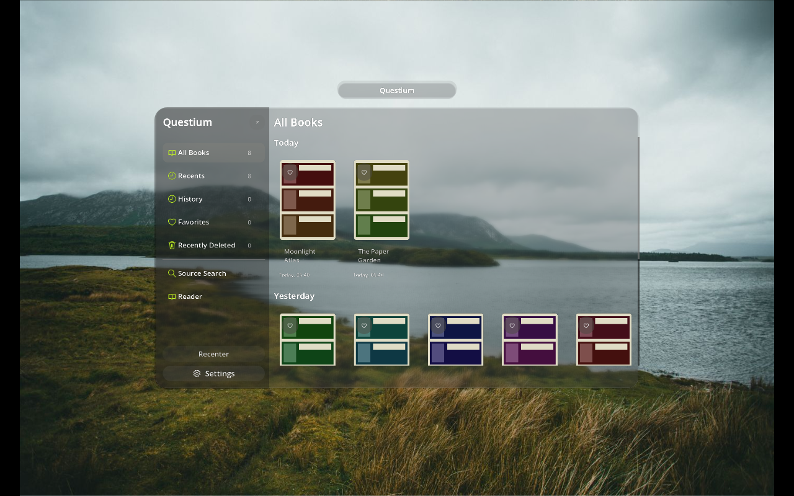
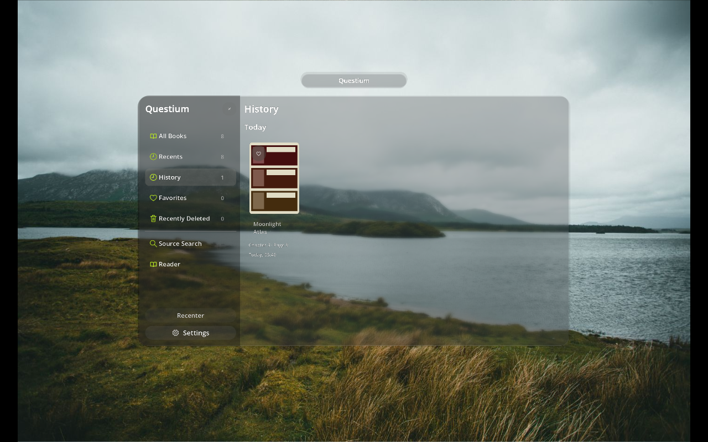
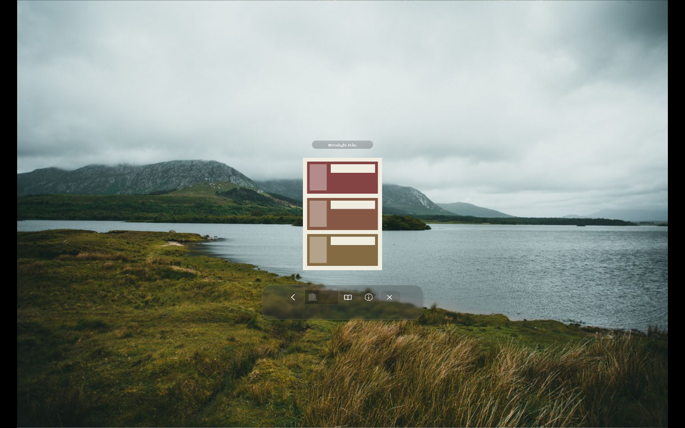
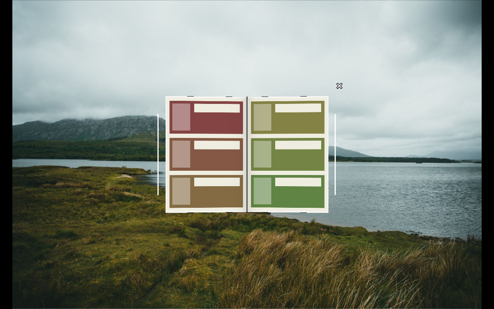
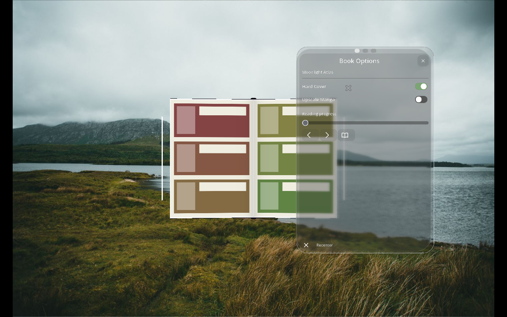
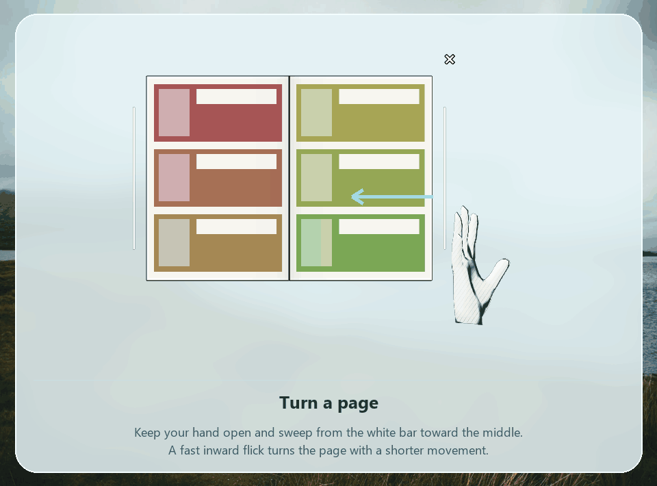
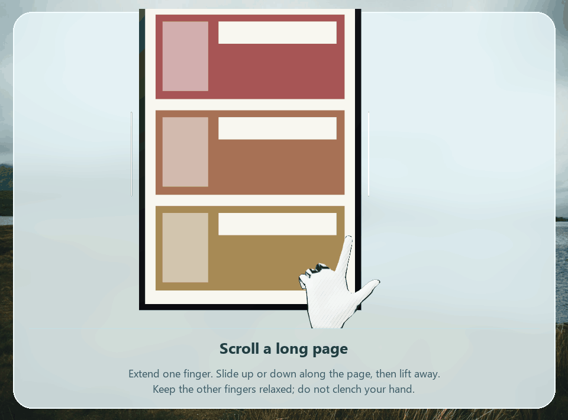
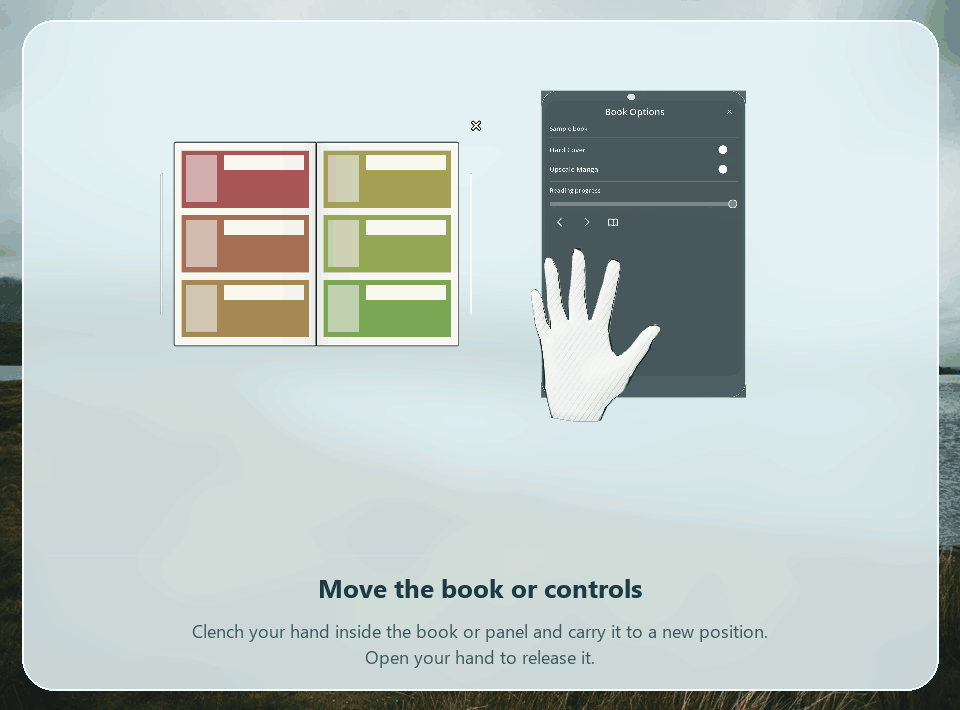
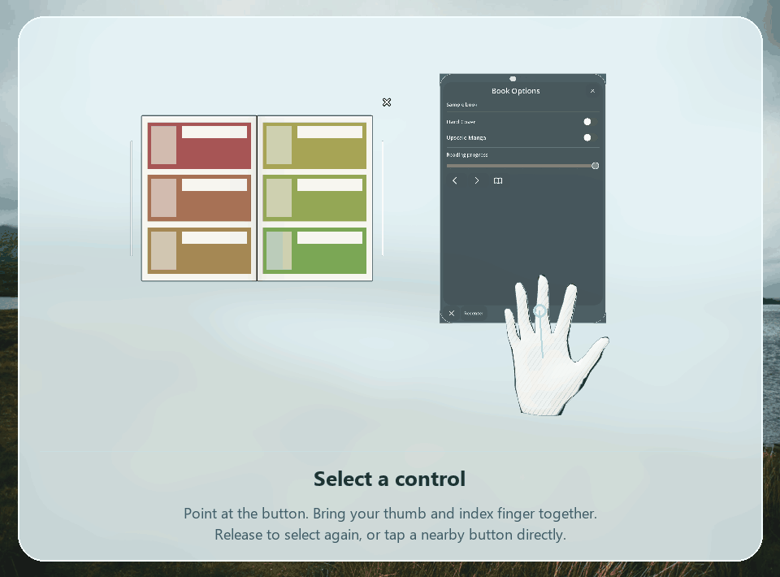

<div align="center">


# Questium

A spatial manga reader for Meta Quest 3 and Quest 3S.

[Download v1.0.0](https://github.com/Kirogii/VR-Tachiyomi/releases/tag/v1.0.0) · [Report a bug](https://github.com/Kirogii/VR-Tachiyomi/issues) · [Build and signing guide](.github/QUEST_BUILD.md)

</div>

**Alpha testing:** Most features are added, but Questium is still in alpha testing. Bugs and unfinished behavior remain. A regular GitHub release does not mean production readiness.

## Read in your own space

Questium opens directly into passthrough with a frosted glass interface. Browse real book covers, search installed sources, save books, and resume chapters. Open a cover into a spatial book with bending pages, or use continuous long-page scrolling for webtoons. No locomotion is required.

- Home, reading History, favorites, source search, and extension repository management.
- Hand tracking and controller input; movable HUDs and closable popups.
- Non-dominant-hand seeker, manual recentering, book resizing, and adjustable UI distance.
- Reader color filters, page fitting, border cropping, reading direction, and per-book forced two-page or long-page mode.
- Optional AI upscaling in both spatial reader modes. Novel support and translation are deferred in this Quest APK.

## Application screenshots

These are captures rendered by the application with generated sample covers and pages. They show the current controls and book meshes against a photographic background fixture; they are not headset recordings.

| Library | Reading History |
| --- | --- |
|  |  |

| Cover preview | Two-page reader |
| --- | --- |
|  |  |



## Hand gesture tutorials

The frosted Aero illustrations use outlined, animated hands from the same skinned hand model as the application's fallback hand renderer. They explain movement and pose; they are demonstrations rather than headset tracking recordings.

### Turn a page



Hold an open hand in a chopping pose beside a white page bar, with fingers extended and your hand edge toward the book. Sweep inward toward the spine. The leaf bends with the sweep. A quick inward flick can finish a turn before reaching the middle. Move back to an outer edge before turning again. Pinching is not required.

### Scroll a long page



Extend your index finger near the page and slide upward or downward along its surface. Use a pointing finger instead of a clenched grip to scroll without moving the book. Choose **Force Long Scroll** in book options when needed.

### Move a book or panel



Put your hand inside the book or HUD, clench it, and move while holding the grip. Open your hand to release. Popups can be moved the same way. Interacting with the main HUD minimizes open popups.

### Select a button



Aim your hand at the control, then pinch your thumb and index finger. Release before selecting again. You can also directly tap a button with your fingertip. Interacting with a text field opens the native Quest keyboard.

### Resize, seek, and recenter

- **Resize:** pinch both top corners of the book and move your hands apart or together. Both corners must be held. The main HUD also supports resizing.
- **Seeker:** open your non-dominant hand and turn the palm toward your face, with the full front of the hand visible. The seeker stays over that hand and hides when you turn it away.
- **Distance:** away from the panels, hold a fist with your thumb upward like a joystick. Move toward yourself to bring the UI closer, or forward to move it farther away.
- **Recenter:** use the HUD's Recenter button or the Quest recenter action to place the HUD and book in front of your current view. There is no periodic automatic recentering.

## Glass and book options

Allow the Quest camera permission to enable room-color blur on Quest 3/3S. The app downsamples and blurs camera frames in memory; it does not save or upload them. Text, buttons, and covers stay on a separate sharp layer. Without camera access, translucent glass remains available. The camera-based blur approximates room colors and is not a pixel-perfect stereo reconstruction of passthrough.

Book options open on the right. Opening them from the palm seeker places them above your hand; turn the palm away to hide them and face it toward you again to restore them. Swipe horizontally between **Book Options**, **Layout**, and **System Settings**, or tap the three dots. Vertical scrolling and dragging a slider keep the current section.

Enable **Hard Cover** for thicker beveled boards, a rounded spine, and a visible page block. Disable it for the thin, flexible Livro-style book. Chapter content and page-curl controls work with either cover.

## AI upscaling and reader settings

1. Open **Settings → Upscaling** and enable upscaling.
2. Select **Native** mode and download a supported ONNX model.
3. Open a book's options and enable **Upscale Manga** for that book.
4. Use either two-page or long-page mode. Both use the upscaling pipeline.

Simple mode resizes images without AI inference. The Quest build supports ONNX CPU inference and NNAPI when available; it does not include Vulkan/NCNN or translation. Failed inference falls back to the original page. See the [reader settings support matrix](docs/VR_READER_SETTINGS.md) for supported spatial controls and Android-viewer-only settings.

## Install

Download **VR-Tachiyomi-alpha.apk** from the [v1.0.0 release](https://github.com/Kirogii/VR-Tachiyomi/releases/tag/v1.0.0) and sideload it onto your Quest with ADB or your preferred installer:

```sh
adb install -r VR-Tachiyomi-alpha.apk
```

The signed alpha retains its existing application ID and signing key, so updates preserve the existing library. Install source extensions and add repositories through Source Search. Questium hosts no manga content and is not affiliated with content providers.

## Build and documentation media

GitHub Actions installs Godot and the Android build tools, builds the VR pack and APK, verifies checks, and signs the APK using repository secrets. Tagged `v1.0.*` builds publish release assets. See [build and signing instructions](.github/QUEST_BUILD.md).

To reproduce the screenshots and gesture frames, run Godot from the repository root:

```sh
godot --path xr --xr-mode off --script tests/docs_capture.gd
godot --path xr --xr-mode off --script tests/gesture_capture.gd
python scripts/make-gesture-gifs.py --frames "D:/VR Kommiku/artifacts/docs-media"
```

The capture script uses local documentation fixtures and never loads a personal manga library. Pillow is required to assemble the GIFs.

## Credits and license

Questium builds on [Houri](https://github.com/PineappleTwilight/houri), Komikku, Mihon, TachiyomiSY, and Tachiyomi. Their contributors provide the manga backend and Android reader foundation. The bundled hand assets retain their [license and attribution](xr/hands/LICENSE).

Tutorial and screenshot background: [photograph by Jonathan Cooper](https://www.pexels.com/photo/mountains-landscape-with-lake-11893882/), used under the [Pexels license](https://www.pexels.com/license/). The photo is a documentation asset only.

Code is licensed under the [Apache License 2.0](LICENSE). Copyright 2015 Javier Tomás and contributors. See [CONTRIBUTING.md](CONTRIBUTING.md) and [CODE_OF_CONDUCT.md](CODE_OF_CONDUCT.md) for contribution guidance.
